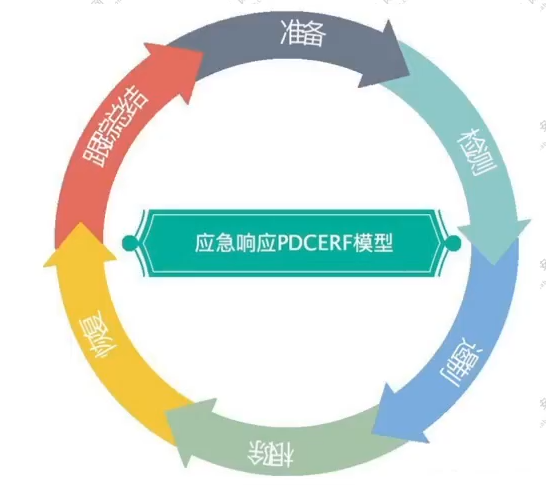

本教程学自B站[白帽子安全博主](https://www.bilibili.com/video/BV1Cp4y1T7Ne/?vd_source=54b069f7c1be25b3d4bfeb5b943a0859)

# 第一课：护网蓝队事件类型

事件级别分为：

1. 特别重大事件：红色预警、一级响应
2. 重大事件：橙色预警、二级响应
3. 较大事件：黄色预警、三级响应
4. 一般事件：蓝色预警、四级响应

事件类型（这里面提到的几个分别是什么）分为：

1. 应用安全：Webshell、网页篡改、网页木马
2. 系统安全：勒索病毒、挖矿木马、远控后门
3. 网络安全：DDOS攻击、ARP攻击、流量劫持
4. 数据安全：数据泄露、损坏、加密

蓝队应急流程：

1. 准备阶段
2. 检测阶段
3. 抑制阶段
4. 根除阶段
5. 恢复阶段
6. 总结阶段

